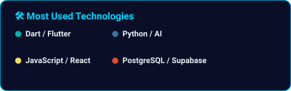

<!-- HEADER WAVE -->


<!-- ANIMATED TYPING SVG -->
<p align="center">
  <a href="https://github.com/iblamesurya">
    
  </a>
</p>

<!-- SOCIAL BADGES -->
<p align="center">
  <a href="https://github.com/iblamesurya">
    
  </a>
  &nbsp;
  <a href="https://linkedin.com/in/surya-tummala">
    
  </a>
  &nbsp;
  <a href="mailto:nothinsurya@gmail.com">
    
  </a>
  &nbsp;
  
  &nbsp;
  
</p>

---

<!-- ABOUT ME SECTION -->
### 👨‍💻 About Me


```python
class SuryaTummala:
    def __init__(self):
        self.name       = "Tummala Surya Teja"
        self.roles      = ["AI Systems Builder", "Full-Stack Architect", "Flutter Explorer"]
        self.location   = "Vijayawada, Andhra Pradesh, India 🇮🇳"
        self.education  = "B.Tech CSE"

    def tech_stack(self):
        return {
            "ai_agents": ["Gemini 2.0 / Flash", "MCP Servers", "RAG Pipelines", "OpenClaw"],
            "mobile":    ["Flutter", "Dart", "Riverpod", "Clean Architecture"],
            "web":       ["React", "Next.js", "JavaScript", "HTML5 / CSS3"],
            "backend":   ["Supabase", "Firebase", "PostgreSQL", "FastAPI", "Python"]
        }

    def current_focus(self):
        return [
            "🌊 AquaVerse AI — Intelligent aquaculture tech for farmers",
            "🌱 Agentic Workflows, MCP Tooling & Multi-Agent Systems",
            "👯 Open source collaborations & community building",
            "⚡ Turning caffeine into production code ☕"
        ]
```

<br clear="right"/>

---

<!-- GITHUB STREAK STATS -->
## 🔥 Streak Stats

<p align="center">
  
</p>

---

<!-- TECH STACK -->
## 🛠️ Tech Stack & Tools

<!-- Animated 3D Icons from TechStack Generator -->
<p align="center">
  
  
  
  
  
  
</p>

<!-- 3D-Style Badges -->
<p align="center">
  
  
  
  
  
  
  
  
</p>
<p align="center">
  
  
  
  
  
  
  
  
  
  
</p>

<details>
<summary><b>🔍 Full Stack Breakdown</b></summary>
<br/>

| Layer | Technologies |
|:------|:-------------|
| 📱 **Mobile** | Flutter 3.x · Dart · Material 3 · Riverpod · go_router · Clean Architecture |
| 🌐 **Web** | HTML5 · CSS3 · JavaScript (ES6+) · React · Next.js · Responsive UI |
| 🗄️ **Backend** | Supabase · PostgreSQL · Row-Level Security (RLS) · Realtime Data |
| 🔐 **Auth** | Supabase Auth · Phone OTP · JWT Sessions · OAuth |
| 🤖 **AI / ML & Agents** | Gemini 2.0 / Flash API · MCP Servers (FastMCP) · RAG Pipelines · OpenClaw |
| 🔔 **Notifications** | Firebase Cloud Messaging (FCM) · flutter_local_notifications |
| 🌤️ **APIs & Cloud** | OpenWeather · Google Maps · Supabase Storage · RESTful Endpoints |
| 🔊 **Voice & Multimodal** | flutter_tts · speech_to_text · Telugu Regional Voice NLP |
| 📊 **Analytics** | fl_chart · Custom Farmer KPI Dashboards · Realtime Telemetry |

</details>

---

<!-- FEATURED PROJECT -->
## 🌊 Featured Project — AquaVerse AI

<table align="center">
<tr>
<td align="center" width="50%">

**🎯 What it does**
- 🦐 AI disease detection via mobile camera
- 💧 Water quality monitoring & prediction
- 🧠 Conversational voice assistant in regional Telugu
- 📊 Realtime shrimp growth & feed analytics
- 💰 Farm finance, expense, and yield forecasting

</td>
<td align="center" width="50%">

**⚙️ How it's built**
- Flutter + Riverpod (Feature-first Clean Architecture)
- Supabase PostgreSQL + Auth + Cloud Storage
- Firebase Cloud Messaging & push alerts
- Gemini Multimodal AI + Weather API integration
- 20+ relational PostgreSQL tables with RLS policies

</td>
</tr>
</table>

<p align="center">
  <a href="https://github.com/iblamesurya/aquaverse-ai-v1">
    
  </a>
</p>

---

<!-- PACMAN CONTRIBUTION GRAPH -->
## 🕹️ Pac-Man Eats My Contributions!

<p align="center">
  <picture>
    <source media="(prefers-color-scheme: dark)" srcset="https://raw.githubusercontent.com/iblamesurya/iblamesurya/output/pacman-contribution-graph-dark.svg"/>
    <source media="(prefers-color-scheme: light)" srcset="https://raw.githubusercontent.com/iblamesurya/iblamesurya/output/pacman-contribution-graph.svg"/>
    
  </picture>
</p>

<!-- SNAKE CONTRIBUTION GRAPH -->
<p align="center">
  <picture>
    <source media="(prefers-color-scheme: dark)" srcset="https://raw.githubusercontent.com/iblamesurya/iblamesurya/output/github-snake-dark.svg"/>
    <source media="(prefers-color-scheme: light)" srcset="https://raw.githubusercontent.com/iblamesurya/iblamesurya/output/github-snake.svg"/>
    
  </picture>
</p>

---

<!-- GITHUB STATS + TOP LANGUAGES -->
## 📊 GitHub Stats

<!-- Stats are auto-generated by the stats.yml workflow and committed to this repo -->
<p align="center">
  
  &nbsp;
  
</p>

---

<!-- MISSION STATEMENT -->
## 🌟 Mission Statement

<p align="center">
  
</p>

> _Passionate about building impactful software with **AI Agents**, **Flutter**, and **scalable distributed systems**._  
> _Democratizing technology and turning complex ideas into production-ready reality._ 🚀

---

<!-- RANDOM DEV QUOTE -->
## 💬 Random Dev Quote

<p align="center">
  
</p>

---

<!-- FOOTER WAVE + CTA -->
<p align="center">
  <i>⚡ Open to internships, collaborations & research in AI Agents · Full-Stack · Flutter · AgriTech</i>
  <br/><br/>
  <a href="https://github.com/iblamesurya">
    
  </a>
  &nbsp;
  <a href="mailto:nothinsurya@gmail.com">
    
  </a>
</p>


